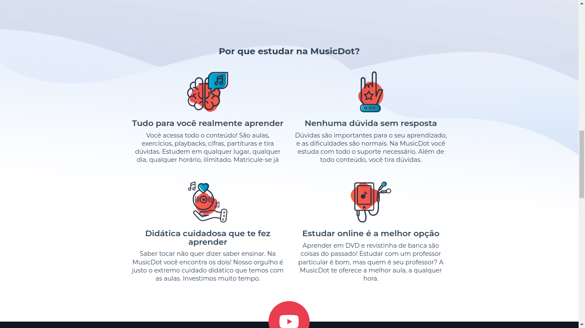
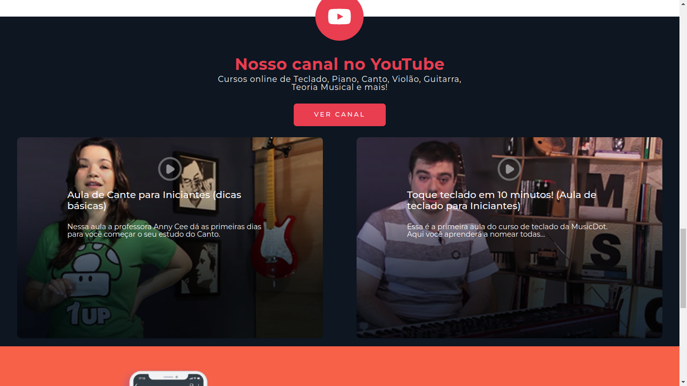
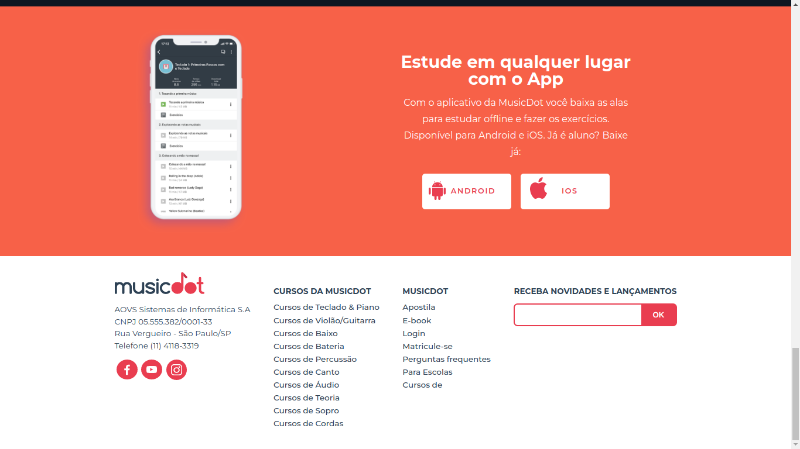

# MusicDot

MusicDot website developed during the study of handout "Desenvolvimento Web com HTML, CSS e JavaScript", avaliable in:  https://www.alura.com.br/apostila-html-css-javascript/ .
During this course I studied HTML, CSS and JavaScript. Also I've studied Bootstrap as additional.
Obs.: there's an unic site, responsive, to the mobile and desktop.

Some screens developed during the course:

## Mobile
    

## Desktop
    
